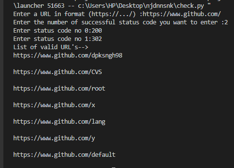

# Minimal Web Path Bruteforcer
-> It is implemented in python 
-> It takes single URL input from the user
-> It takes N success codes as input
-> The overall complexity is MxN where M is number of elements in wordlist and N is number success codes in the list given as input by the user

# Sample Output:

